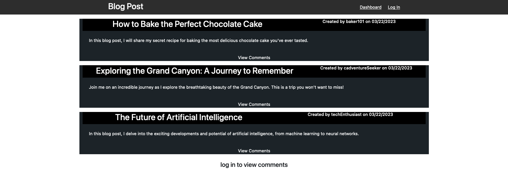

For more information on MIT visit https://opensource.org/licenses/MIT
# <EasyBlog>

## Description

EasyBlog is a content management system designed to publish blog posts and engage with the community. This application follows the MVC (Model-View-Controller) paradigm and is built from scratch using various technologies. Developers can create, and delete blog posts, comment on posts.

## Table of Contents

- [Installation](#installation)
- [Usage](#usage)
- [Credits](#credits)
- [License](#license)

## Installation

To get started with our project, follow these steps:

1. Open up the terminal.
2. Run the following command to install dependencies: (npm i)
3. Set up your MySQL database:
4. Start the application: (npm start) or (npm run watch)

## Usage

1. Make an account.
2. Got to profile and make a blog post.

    <a href='https://easyblogs1-0a58a50a4e3a.herokuapp.com/'>website Link</a>

## Credits

Ask BCS - help with general info.
<a href="https://sequelize.org/docs/v6/">Sequelize Doc</a>
<a href="https://developer.mozilla.org/en-US/">MDN docs</a>

## License

MIT License

Copyright (c) 2023 Daniel A Zarate

Permission is hereby granted, free of charge, to any person obtaining a copy
of this software and associated documentation files (the "Software"), to deal
in the Software without restriction, including without limitation the rights
to use, copy, modify, merge, publish, distribute, sublicense, and/or sell
copies of the Software, and to permit persons to whom the Software is
furnished to do so, subject to the following conditions:

The above copyright notice and this permission notice shall be included in all
copies or substantial portions of the Software.

THE SOFTWARE IS PROVIDED "AS IS", WITHOUT WARRANTY OF ANY KIND, EXPRESS OR
IMPLIED, INCLUDING BUT NOT LIMITED TO THE WARRANTIES OF MERCHANTABILITY,
FITNESS FOR A PARTICULAR PURPOSE AND NONINFRINGEMENT. IN NO EVENT SHALL THE
AUTHORS OR COPYRIGHT HOLDERS BE LIABLE FOR ANY CLAIM, DAMAGES OR OTHER
LIABILITY, WHETHER IN AN ACTION OF CONTRACT, TORT OR OTHERWISE, ARISING FROM,
OUT OF OR IN CONNECTION WITH THE SOFTWARE OR THE USE OR OTHER DEALINGS IN THE
SOFTWARE.

## Features

- User account creation.
- Create/Delete posts.
